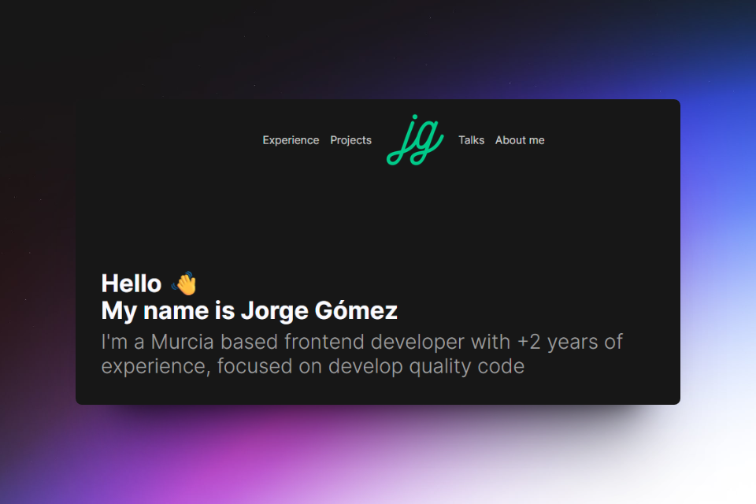

    <a href="https://jgcarrillo.com" target="_blank">
        Website
    </a>
    &nbsp;⁘&nbsp;
    <a href="https://github.com/jgcarrillo/jgcarrillo.astro?tab=readme-ov-file#-stack">
        Stack
    </a>
    &nbsp;⁘&nbsp;
    <a href="https://twitter.com/jgcarrillo_">
        X (formerly Twitter)
    </a>

## 📦 Stack

- [**Astro**](https://astro.build/) - The web framework for content-driven websites.
- [**Typescript**](https://www.typescriptlang.org/) - JavaScript with syntax for types.
- [**Tailwindcss**](https://tailwindcss.com/) - Rapidly build modern websites without ever leaving your HTML.
- [**Tabler Icons**](https://tabler.io/icons) - Pixel-perfect icons for web design.
- [**Fontsource**](https://fontsource.org/) - Open-Source fonts in neatly bundled NPM packages.
